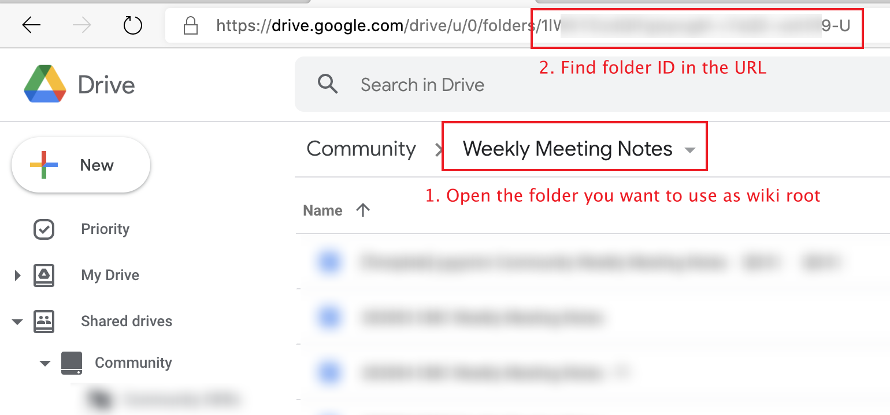
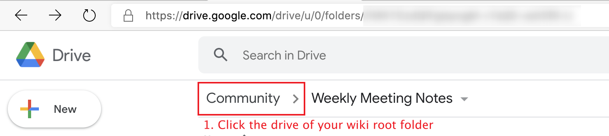
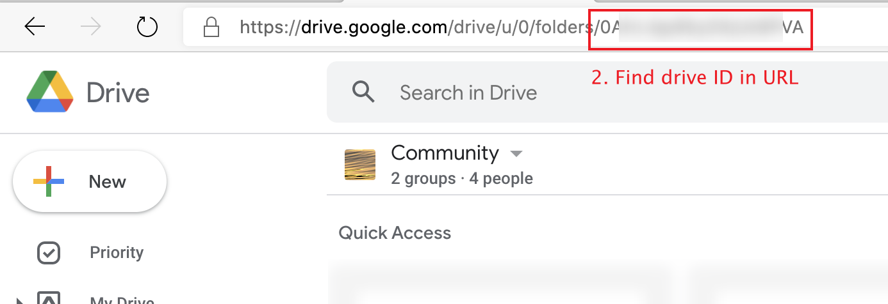

# gdocwiki

A wiki based on Google Doc / Drive.

## Getting Started

1. Install [Node.js](https://nodejs.org/en/download/package-manager/), [yarn](https://classic.yarnpkg.com/en/docs/install)

2. Install dependencies:

   ```shell
   yarn
   ```

3. Create `.env.local` file for configuration. See [Configuration](#configuration) section below.

4. Start a local development server:

   ```shell
   yarn start
   ```

5. Navigate to http://localhost:3000

## Configuration

You should set up a configuration for local development and building by creating a `.env.local` file. This file is not needed for deployment, since it is embedded into the artifact during the building process.

A sample `.env.local` file could be:

```plain
REACT_APP_GAPI_KEY=xxxxxxx
REACT_APP_GAPI_CLIENT_ID=xxxxxxx
REACT_APP_ROOT_ID=xxxxxxx
REACT_APP_ROOT_DRIVE_ID=xxxxxxx
```

- `REACT_APP_GAPI_KEY`: The Google API Key.

  Google API Key can be obtained by following the [Setting up API keys](https://support.google.com/googleapi/answer/6158862) documentation.

- `REACT_APP_GAPI_CLIENT_ID`: The Google API OAuth Client ID.

  The OAuth Client ID can be obtained by following the [Setting up OAuth 2.0](https://support.google.com/googleapi/answer/6158849) documentation.

  Steps in the "User consent" section in the documentaton above should be completed as well, with the following scopes added:

  - `auth/drive`
  - `auth/documents`

- `REACT_APP_ROOT_ID`: The ID of the Google drive folder that you want to display as the wiki root folder.

  

  There may be hyphens in the ID. The wiki root folder is not limited to a sub-folder in the shared drive. It could be the shared drive root folder.

  **Note**: Only folders in the "[Shared drives](https://support.google.com/a/users/answer/9310351)" are supported. Folders in the "My Drive" are not supported.

- `REACT_APP_ROOT_DRIVE_ID`: The drive ID where your wiki root folder belongs.

  

  

## Roadmap

- [x] User
  - [x] Sign in
    - [x] Notify for sign in
    - [x] Error handling for unprivilege errors
  - [x] Sign out
    - [x] A better UI for sign out
- [x] Sidebar
  - [x] Expand all
  - [x] Collapse all
  - [x] Configure specific folder children to be displayed in sidebar or not
    - [ ] Activate nearest displayed parent
  - [x] Activate and expand sidebar item according to current page
  - [x] Support >500 pages in the sidebar
  - [x] Support external link in syntax `[xxx](https://yyy)`
    - [ ] Open Google drive external links in wiki directly
- [x] Content Preview
  - [x] Google doc
    - [x] Rewrite links to open in wiki directly
    - [x] Support #xxx anchors in the Google doc
    - [ ] Prettify
      - [x] Pretty font families
      - [x] Pretty monospace fonts
      - [ ] Adjust incorrect margins and paddings
  - [x] Google spreadsheet
  - [x] Google presentation
  - [x] PDF
  - [x] MS Word / Excel files
  - [x] Shortcut
    - [x] File
    - [x] Folder
  - [x] Folder
    - [x] Click folder item to jump
    - [ ] Sort folder items
    - [x] Display `README` in the folder inline
    - [x] Support > 1000 folder items
  - [x] Drive Root
- [x] Breadcrumb Navigation
  - [x] Create file in current folder
  - [x] Open current file in Google Doc / Google Drive
    - [x] Google Doc
    - [x] Google Spreadsheet
  - [x] Open current folder in Google Drive
  - [x] Rename
  - [x] Trash
  - [x] Move in a file
    - [ ] Notification when the file cannot be moved out again
    - [x] Move using shortcut
  - [x] Move in a folder (a shortcut will be always created for now?)
  - [ ] Move to another tree location
- [x] Natural sort
- [x] Update Title Dynamically
- [ ] Cache
  - [x] Utilize cache to load folder content
  - [ ] Cache preview when file is not modified
  - [ ] Update file and folder cache in background when accessing a folder or file
  - [ ] Watch changes from cached entities
  - [ ] Improve first screen load performance
- [x] Search
  - [x] Full text
  - [x] File name
- [ ] Mobile Support
  - [ ] Responsive Sidebar
- [ ] Helpers
  - [ ] A Chrome extension for checking whether the doc is in the tree

## Note

This is not an official PingCAP product.
